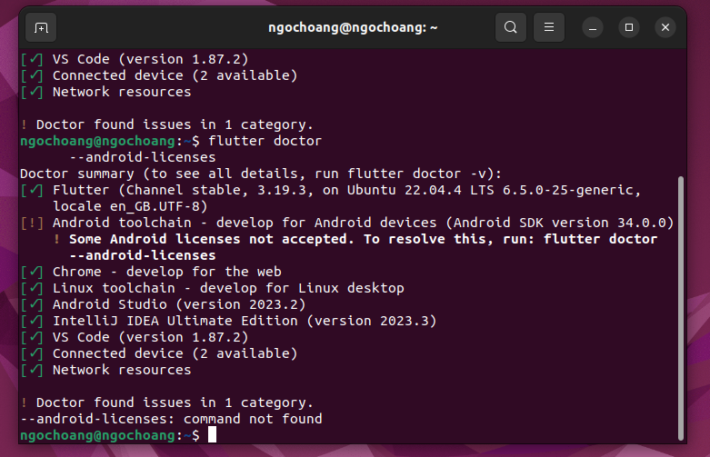
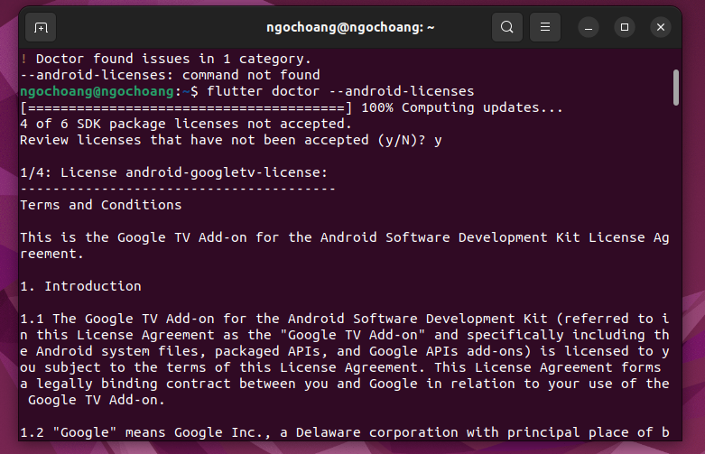
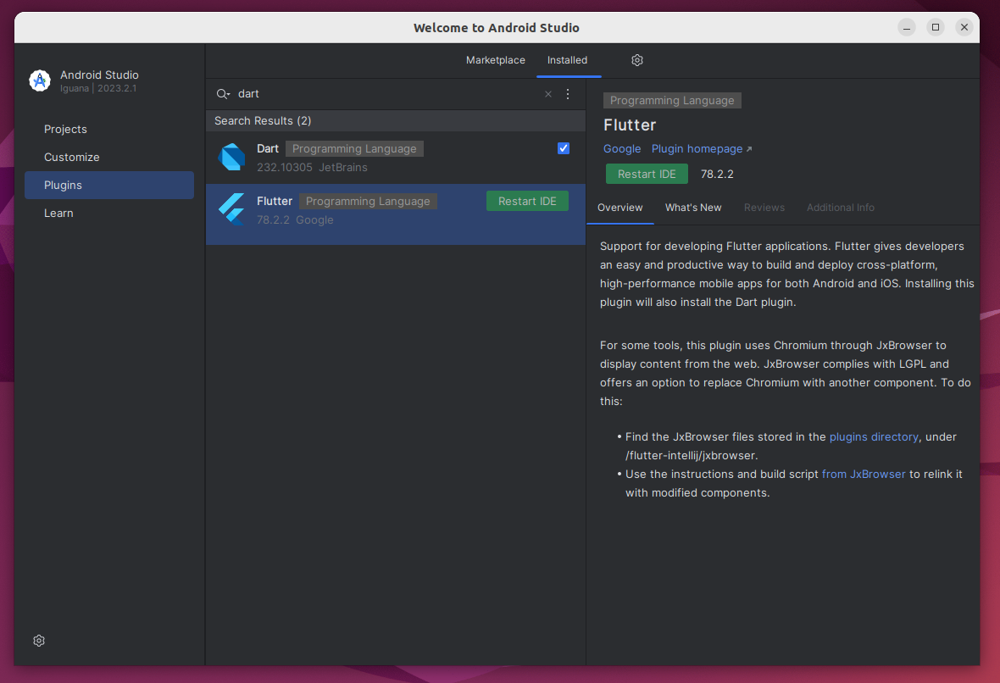
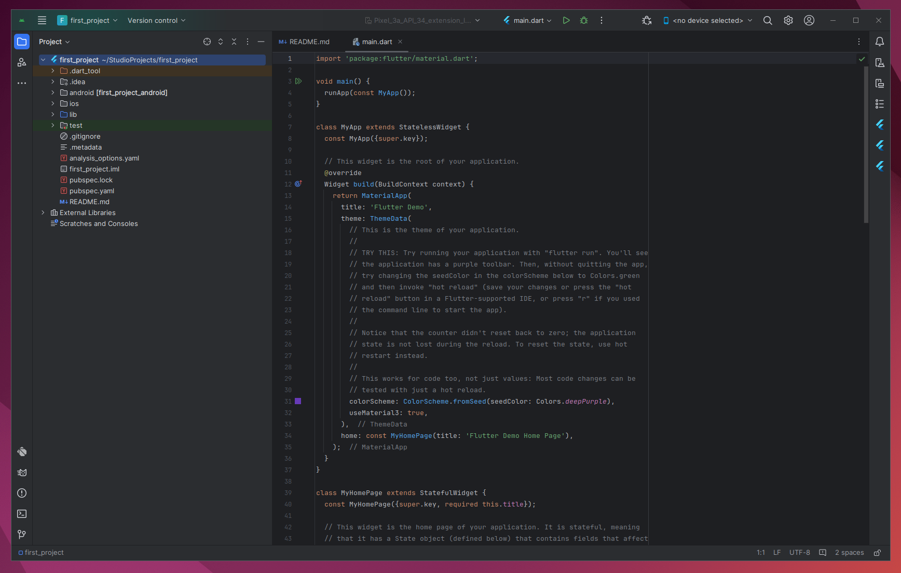
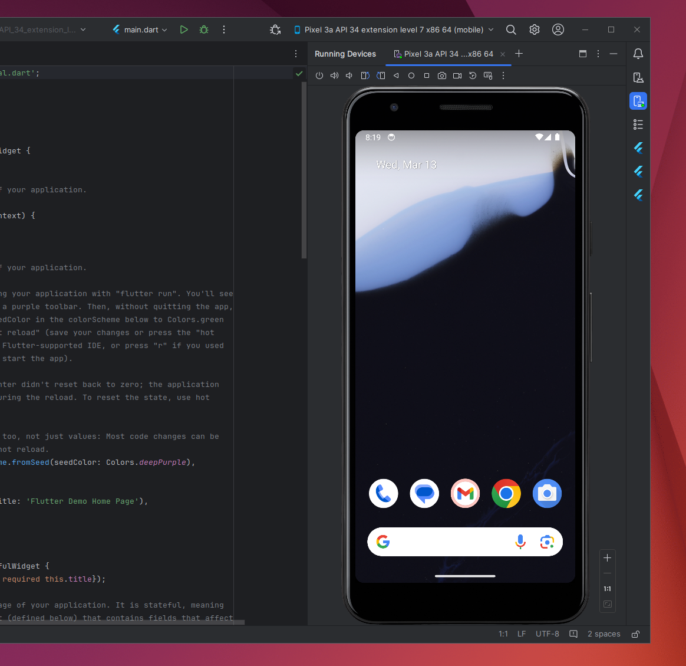
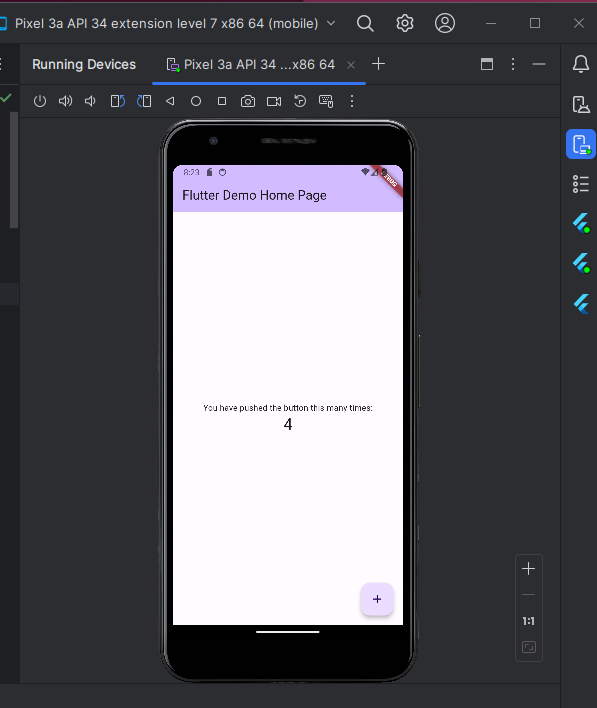
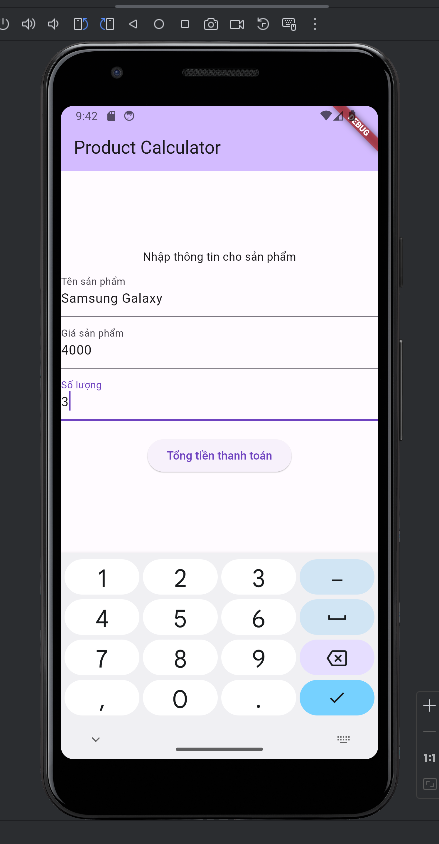
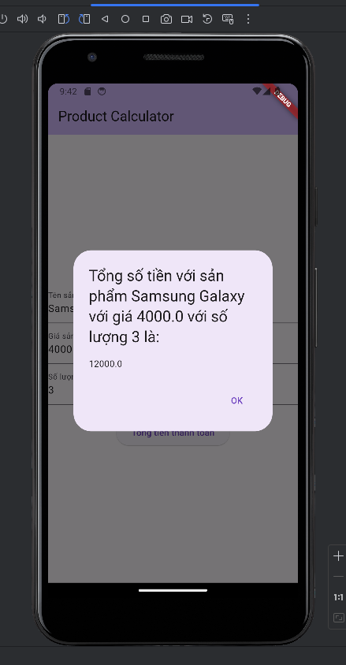

# Day 1

## Cài đặt Flutter + Android Studio + Chạy demo 
### Sau khi cài Flutter & Android trên trang chủ chạy câu lệnh `flutter doctor`

### Lúc này nhận được cảnh báo android license không được chấp nhận, chạy câu lệnh sau `flutter doctor --android-licenses`

### Cài plugin Flutter và Dark trong Android 

### Giao diện project

### Chạy máo ảo android emulator

### Chạy project và được kết quả sau

## Kết quả bài tập về 

